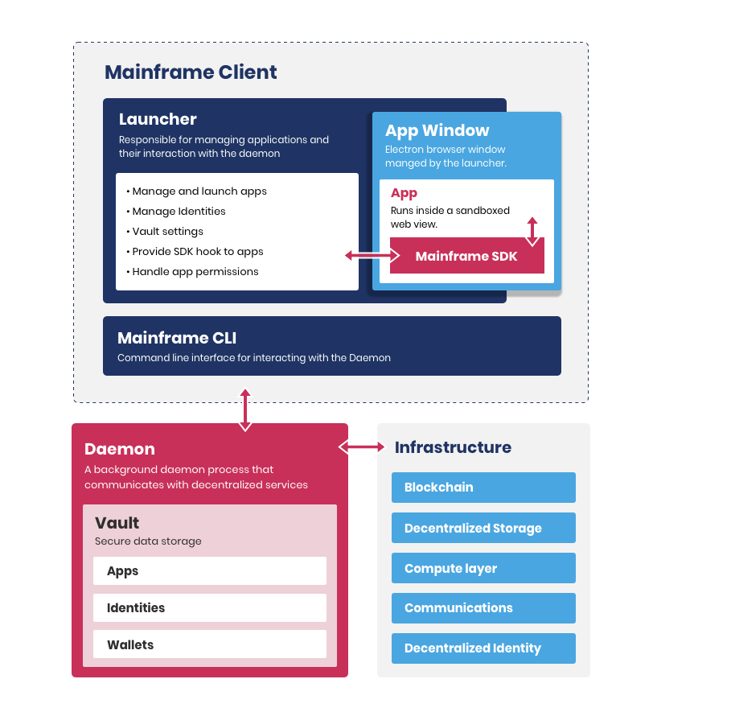

# Mainframe OS architecture

## Introduction

The Mainframe OS aims to provide a full-feature application platform on top of decentralised infrastructure, based on the Ethereum blockchain and the Swarm file storage and communication network.

The main objectives are to provide a consistent user experience to end-users, simplifying aspects of managing their own data and interacting with apps with strong security and privacy safeguards, while also providing a better experience for developers, by abstracting away the complexity of decentralised infrastructure in simple APIs and guidelines.

## Code repositories

The following 3 repositories currently contain most of the logic used by the Mainframe OS:

- [`js-mainframe`](https://github.com/MainframeHQ/js-mainframe) can be considered the core Mainframe OS repository, it contains code for the binaries and platform-specific libraries.
- [Erebos](https://erebos.js.org) is the Swarm client library developed and maintained by Mainframe, used by the Mainframe OS but built as a generic library that can be used for any application interacting with Swarm.
- [`js-tools`](https://github.com/MainframeHQ/js-tools) contains lower-level libraries used by the Mainframe OS binaries and libraries, and by Erebos. It notably contains libraries to communicate over JSON-RPC, various transport layers (IPC, WebSockets, ...) and cryptography utilities.

These repositories leverage [Yarn workspaces](https://yarnpkg.com/lang/en/docs/workspaces/) to easily manage links between related packages.

## Core concepts

- Like other "blockchain" projects, all code is open-source so it can be freely audited and edited by third-parties. Mainframe as a company shouldn't be an entity end-users and developers need to "trust" without being able to verify our claims.
- Mainframe aims to build an ecosystem going beyond "Mainframe the company", and notably allow third-party implementations of the Mainframe OS to thrive. The Mainframe OS architecture is made of various components communicating over JSON-RPC rather than a single monolith doing everything.
- The Mainframe OS is first implemented in JavaScript for the following reasons:
  - Apps running in the Mainframe OS should be sandboxed so the platform can provide security and privacy safeguards. Electron on desktop and WebViews on Android and iOS provide ways to support this.
  - The Mainframe engineering team has previous experience building cross-platform apps using Electron.
  - Using JavaScript in other components of the stack allows for code reuse with shared libraries.

## Platform stack

The platform exposes 3 binaries:

- The `daemon` is the background process interacting with the vault and the underlying infrastructure services (currently Ethereum and Swarm).
- The `launcher` and the `CLI` are both trusted clients communicating with the daemon:
  - The `launcher` is the end-user "Mainframe OS" application, it supports managing identities, wallets and apps on behalf of the user, and runs apps in a sandboxed environment.
  - The `CLI` is meant for Mainframe and third-party developers. It provides more advanced features to interact with the `daemon`, complementary to the ones provided in the `launcher`.

Both the `launcher` and the `CLI` use the `client` library to interact with the `daemon`.

All these binaries run in a specific environment. Environments are managed by the `config` library and notably store the paths to the different binaries and other default folders for vault files and downloaded app contents.
Using multiple environments allows to run completely isolated versions of the Mainframe OS in parallel, but in most cases only one environment is needed, and defined as the default environment so it doesn't need to be provided for most interactions.

The `launcher` is responsible for running apps in a sandboxed environment. It provides a hook in this sandbox that is used by the `SDK` to interact with the rest of the platform.
The `SDK` communicates with the `launcher`, that check permissions and eventually calls the `daemon` to handle the relevant interactions. While the communication between the `launcher` and the `daemon` is trusted, the `launcher` needs to verify the validity of calls made by the `SDK` as they originate from a potentially untrusted app.

## Usage flow

In order to use the `launcher` and most `CLI` commands, the `daemon` needs to be running. It can be started from the `CLI`, assuming the environment is properly setup.

To handle user interactions, the `client` (and therefore the `launcher` and `CLI`) need to create or open a vault it is going to interact with.
A vault is a data structure internal to the daemon that stores and manipulates sensitive information for the users, such as cryptographic keys, personal information and application permissions. This data structure is also meant to be serialised to an encrypted JSON file, so that its contents can be backed-up and transferred to other devices.

Once a `client` successfully opens a vault, it is considered as trusted by the `daemon` and gains exclusive access to this vault (at least for the given environment - vault files are not protected across different environments). This restriction is only meant to prevent concurrency issues that could arise from having multiple clients interacting with the same vault, future versions of the platform might support this use case.

After the `launcher` is started and has successfully opened a vault, it can interact with the daemon using any of the APIs provided by the `client`, notably managing the apps, identities and wallets stored in the vault.
The `launcher` can also run apps by creating a session providing the app ID and user ID. The `daemon` will provide the `launcher` metadata such as the permissions granted by the given user for the app. The `launcher` is then responsible for enforcing these permissions and prompting the user for any additional grant.

The `launcher` runs apps in a sandboxed [Electron `<webview>`](https://electronjs.org/docs/api/webview-tag) and injects a hook to allow communication between the app and the Electron main process. The `SDK` uses this hook to provide APIs interacting with the platform and potentially the rest of the ecosystem.

## Applications lifecycle

Mainframe apps can leverage any Web technology supported by Electron (Chromium). All the assets (HTML, JS, CSS files, images, etc.) necessary to run the app should be provided in a folder and only reference one-another using relative paths.
The `launcher` expects an `index.html` file to be present and opens it when the user opens the app.

Along with its contents, an app requires a manifest file to be created. This manifest contains metadata about the app (such as its developer identity, app version, etc.) and a reference to the app contents Swarm hash so the app can be installed, by downloading the contents for the given version from Swarm.

To install an app, an user needs to open its manifest file using the `launcher`, that can then download its contents and setup the necessary data in the vault.
